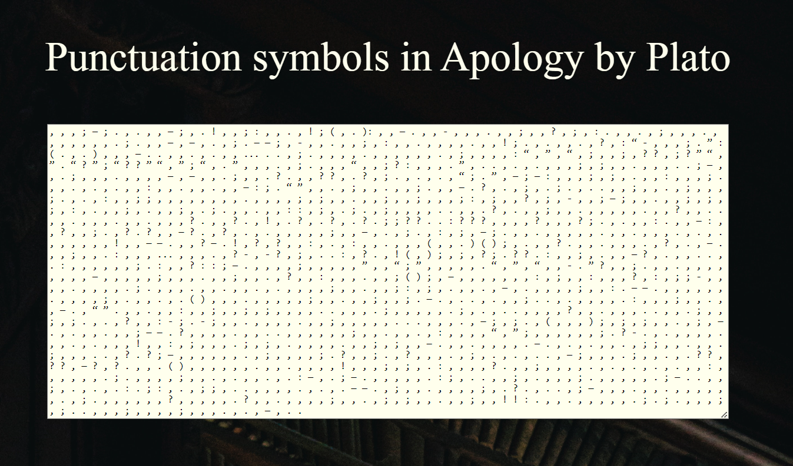

# Punctuation art with Python

In 2022, I saw <a href = https://artishockrevista.com/2022/06/23/pedro-reyes-escultura-social>"Escultura Social" </a>, a collection of pieces by Pedro Reyes. The artist reflected on many current issues but also reflected on the importance of language. The description detailed how the artist thought of punctuation as 2-dimensional sculpture. A symbol which represented an abstract notion.

I later saw the work of [Nicholas Rougeaux](https://www.c82.net/work/?id=347) who also analyzed punctuation, but strictly in the context of analyzing the structure of classical literature, such as Pride and Prejudice, Moby Dick, and Alice's Adventures in Wonderland.

I really enjoyed both of these projects and simply set out to see if I could replicate them. There are several classical texts I enjoy and I wanted to see what they would look like. I was able to use the <a href=https://jss367.github.io/getting-text-from-project-gutenberg.html> code written by Julius Simonelli </a> to scrape raw text data from the Gutenberg project. His code was really helpful.

## Example of how the punctuation poster should look like

## Contents

This repository contains:
- the conda environment I used while working on this project,
- HTML files containing example posters for Emma (Jane Austen) and the Apology (Plato), 
- A png of the Apology poster for demonstration purposes,
- A Jupyter notebook containing the code I used to create the posters,
- The corpora folder contains copies of the texts I scraped from the Gutenberg website,
- The images folder contains the image I used as a backdrop for the poster.
